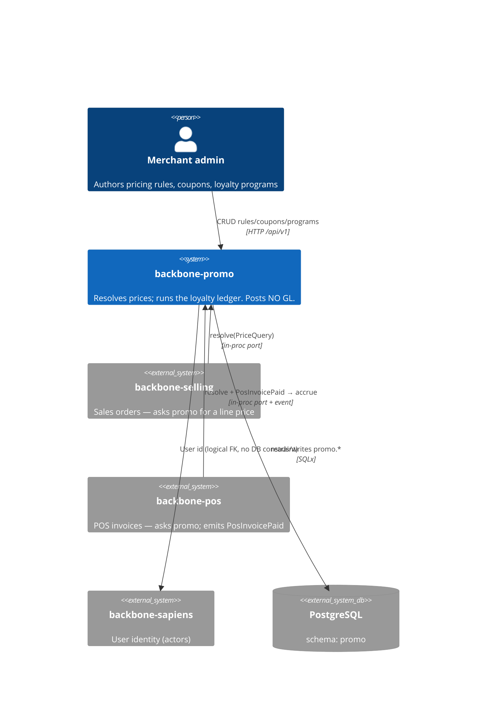
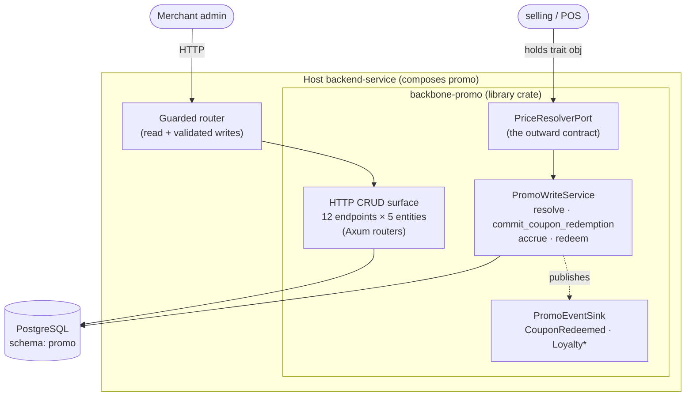
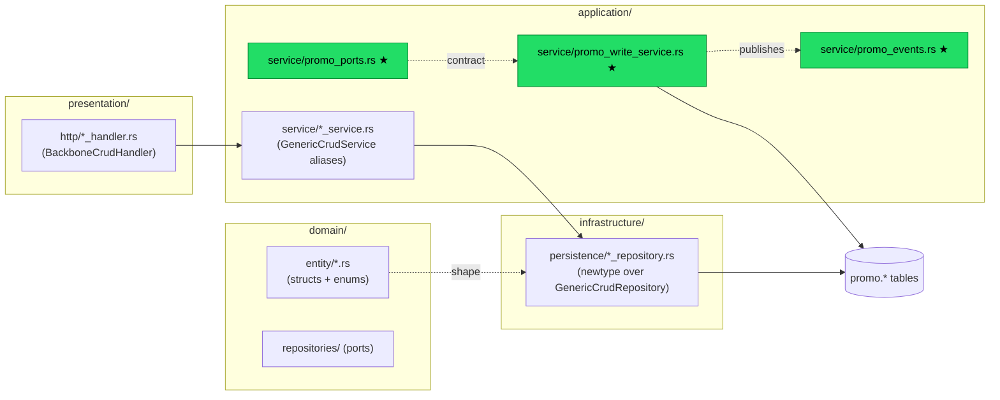
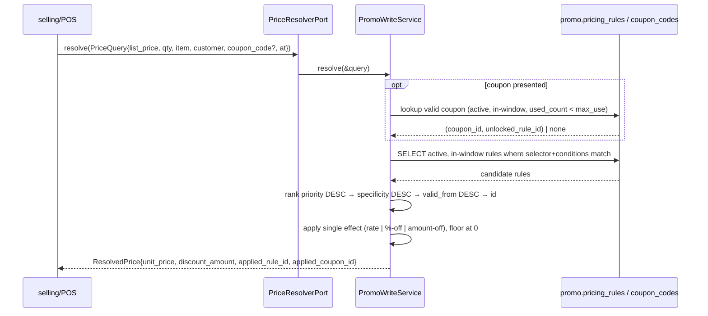
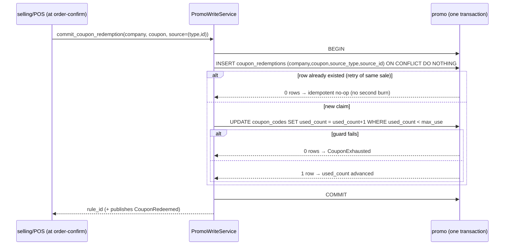
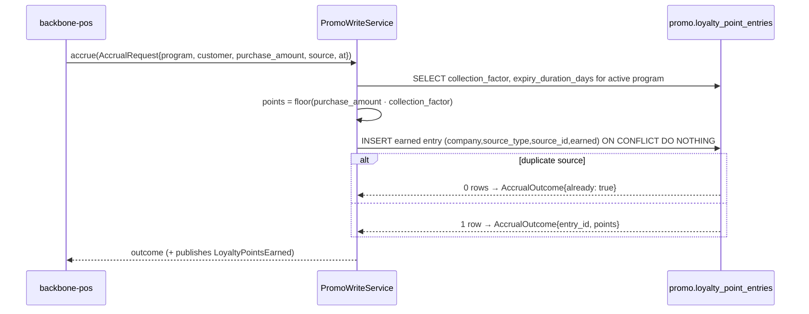

# Architecture

> Reader: **Maintainer** · Mode: **Explanation** · Last reviewed 2026-07-05.
> Top-down [C4](https://c4model.com): system context → containers → components → data/control flow.
> Each diagram has a caption telling you what to notice.

## Level 1 — System context

Who asks promo, and what promo depends on.

**What to notice:** every arrow *into* promo is a request promo answers; promo has **no outbound arrow
to selling or POS**. It depends only on PostgreSQL and, logically, on sapiens for actor ids. The
decoupling is structural, not a convention. (selling/POS are `dev-dependencies` only — used by the seam
tests to prove the contract against the real write paths.)

## Level 2 — Containers

promo is a library crate, so "containers" means the surfaces it exposes inside a host service.

**What to notice:** there are **two doors** into promo. The **HTTP CRUD surface** (generated, admin-facing)
authors the rules; the **port** (hand-authored) answers the hot-path price question. They do not share a
code path — CRUD mutates rows, `resolve` reads and ranks them. The write service is the only thing that
touches money/points logic.

> **Security note.** `PromoModule::all_crud_routes()` (and the deprecated `routes()`) mount all 12
> endpoints with **no domain validation** — a well-formed request can create invalid rows or soft-delete
> a referenced master. For any real deployment, compose a **guarded router** (read + validated writes);
> use the unguarded surface only in trusted/admin/seeding contexts. This is called out in
> [`src/lib.rs`](../src/lib.rs) on the methods themselves.

## Level 3 — Components (the DDD 4-layer shape)

Inside the crate, code is organised in the standard backbone four layers. Generated code is downstream
of the schema; hand-authored code is marked.

★ = **hand-authored, user-owned, survives regeneration.** Everything else is generated from
`schema/models/*.model.yaml`.

| Layer | Directory | What lives here | Generated? |
|-------|-----------|-----------------|-----------|
| **Domain** | `src/domain/entity/`, `src/domain/repositories/` | Entity structs (`PricingRule`, `CouponCode`, …), enums (`ApplyOn`, `RateOrDiscount`, `LoyaltyEntryType`, …), repository trait ports | Generated |
| **Application** | `src/application/service/` | `*_service.rs` type aliases to `GenericCrudService`; **`promo_write_service.rs`**, **`promo_ports.rs`**, **`promo_events.rs`** | CRUD generated; write path ★ hand-authored |
| **Infrastructure** | `src/infrastructure/persistence/` | `*_repository.rs` newtypes over `GenericCrudRepository` | Generated |
| **Presentation** | `src/presentation/http/` | `*_handler.rs` (BackboneCrudHandler wiring), route fns | Generated |
| **Composition** | `src/lib.rs`, `src/routes/`, `src/module.rs` | `PromoModule` + builder; stateless/stateful route composers | Generated skeleton + `// <<< CUSTOM` |

The five entities (`PricingRule`, `CouponCode`, `CouponRedemption`, `LoyaltyProgram`,
`LoyaltyPointEntry`) each get the generated stack; only `PricingRule`, `CouponCode`,
`CouponRedemption`, and the loyalty pair carry hand-authored *behavior* through the write service.

## Level 4 — Data & control flow

### Flow A — resolve a price (the marquee read, side-effect-free)

**What to notice:** resolve **reads only**. Presenting a coupon *previews* the unlocked rule; it does not
advance `used_count`. No applicable rule → `ResolvedPrice::passthrough(list_price)`. This is BR-1/2/3 and
BR-4's preview half. Proven by IP-4 (resolve a gated line 3× → `used_count` stays 0).

### Flow B — commit a coupon redemption (the bounded write, at sale-commit)

**What to notice:** the ledger claim and the counter bump are **one transaction**. The `ON CONFLICT DO
NOTHING` gate gives idempotency *per source document*; the `WHERE used_count < max_use` guard gives the
hard cap under concurrency. Both together are BR-4, proven by IP-1 and PRSEAM-3.

### Flow C — loyalty accrual (idempotent per source)

**What to notice:** the partial unique key `(company, source_type, source_id, earned)` makes a replayed
`PosInvoicePaid` a no-op. Redemption (Flow not shown) mirrors this but takes a per-`(company, customer,
program)` **advisory lock**, checks the signed balance `Σ points`, and writes a negative `redeemed`
entry. BR-5/6, proven by IP-2/IP-3 and PRSEAM-2.

## The seams (dependency-inverted, zero normal Cargo edge)

| Seam | Direction | Mechanism | Proof |
|------|-----------|-----------|-------|
| **Price resolution** | selling/POS → promo | `PriceResolverPort::resolve` (trait obj) | `tests/price_resolution_seam.rs` PRSEAM-1 |
| **Coupon burn** | selling/POS → promo | `commit_coupon_redemption` at sale-commit | PRSEAM-3 |
| **Loyalty accrual** | POS → promo | promo consumes real `PosInvoicePaid` | PRSEAM-2 |
| **Domain events** | promo → subscribers | `PromoEventSink::publish` | analytics / claw-back consumers |

`backbone-selling` and `backbone-pos` are **`dev-dependencies` only** — the seam tests drive their real
write paths, but the shipped promo library has zero normal edges to them (`cargo tree -e normal -i
backbone-selling` is empty). This is the structural guarantee behind [ADR-001](./adr/ADR-001-pricing-boundary-and-resolution-seam.md).

## Persistence notes

- promo owns its **own Postgres schema** (`schema: promo` in `index.model.yaml`); migrations emit
  `CREATE SCHEMA promo` and qualify tables as `promo.<table>`.
- Cross-module ids (company, item/group/brand, customer/group, source docs) are **logical FKs**
  (`@exclude_from_foreign_key_check`) — no DB constraint crosses a module boundary.
- **Idempotency + soft-delete indexes are partial** (`WHERE deleted_at IS NULL`) — a PostgreSQL feature
  the design leans on directly.

---
Next: **[Maintainer guide](./maintainer-guide.md)** — how to change any of this without breaking regen.
